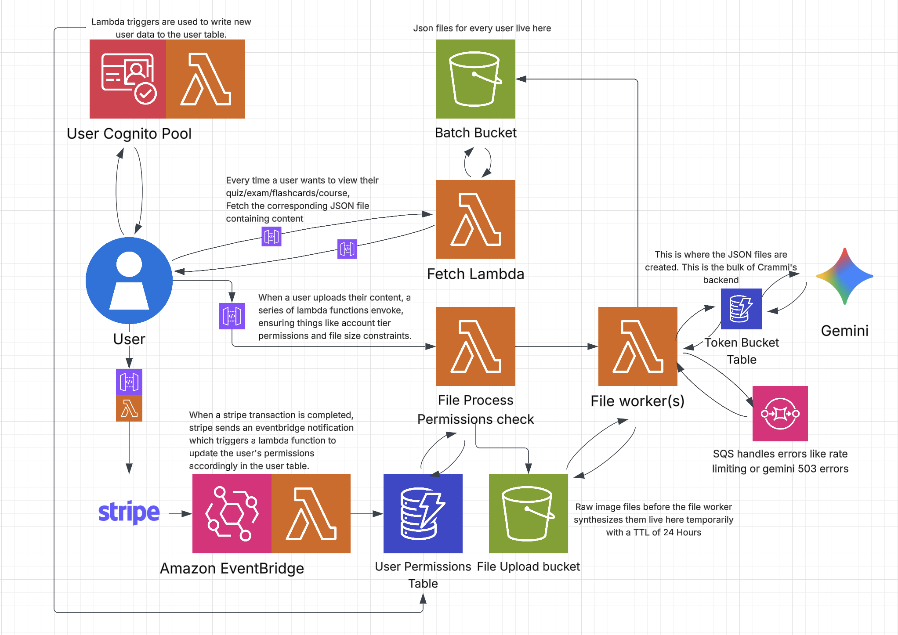

# Crammi

Crammi is an open-source study tool that converts PDFs, uploaded notes, and handwritten notes (via mobile camera) into structured flashcards and quizzes. It includes a React Native mobile application and an AWS-based backend using Python microservices for OCR, text extraction, and NLP-driven flashcard generation.

## Overview

Crammi provides an automated workflow for turning written or digital study materials into organized flashcards. It uses:

A React Native (Expo) mobile frontend

AWS cloud infrastructure for uploads, authentication, and data storage

Python services deployed as AWS Lambda functions for OCR and NLP

## Features
PDF Processing

Extracts text from uploaded PDFs.

Identifies key concepts, definitions, and summaries.

Generates flashcards automatically.

Camera-Based Note Scanning

OCR extract from handwritten notes.

Text cleaning and normalization.

Automatic flashcard and quiz generation.

Flashcard and Quiz Generation

Automatic term-definition flashcards.

Multiple-choice and fill-in-the-blank quiz construction.

Cloud storage of user decks and study progress.

Cloud Infrastructure

Secure file uploads via S3.

Authentication and session handling via Cognito.

Python Lambda functions for OCR, text extraction, and NLP.

## Tech Stack

React Native

React Query

React Navigation

AWS Cloud

API Gateway

Lambda (Python)

S3

DynamoDB

Cognito

CloudWatch

IAM Roles & Policies

Python Services

Tesseract OCR or PaddleOCR

PyMuPDF 

Custom flashcard/quiz generation logic
